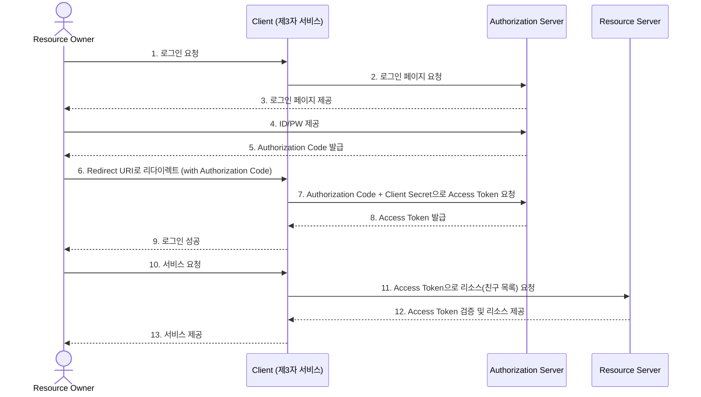

## 📆 2026-05-29

### 📋 Daily Scrum

**어제 한 일**
- 배움 노트 작성 및 TIL 기재
- 한줄 정리
- ERD 작성 30% 완료

**오늘 할 일**
- 배움 노트 작성 및 TIL 기재
- 한줄 정리
- ERD 작성 완료

**회고**
- ERD 작성 완료를 목표로 했었는데 30%밖에 완료하지 못했다. 오늘 반드시 완성하는 것을 목표로 한다.

> 💬 **찰리의 한마디** : 실력은 나이와 상관없다

---

### 🚀 Today I Learned

---

#### | 데이터베이스 동시성 제어

**여러 사용자가 동시에 DB에 접근할 때 발생할 수 있는 문제를 방지하고, 데이터의 일관성과 무결성을 유지하는 기술**

##### Serial vs Non-Serial Schedule

| 구분 | Serial Schedule | Non-Serial Schedule |
|---|---|---|
| **방식** | 트랜잭션이 겹치지 않고 한 번에 하나씩 실행 | 트랜잭션이 겹쳐서 동시에 실행 |
| **일관성** | 높음 | 낮음 |
| **동시성** | 낮음 | 높음 |

> ⚠️ 일관성과 동시성은 **반비례 관계(트레이드오프)** 다.

##### Conflict (충돌)

아래 세 가지 조건을 **모두** 만족하면 Conflict(충돌)로 판단한다.

1. 서로 다른 트랜잭션 소속
2. 같은 데이터에 접근
3. 최소 하나는 Write 작업

수행 순서에 따라 결과가 달라지는 충돌이 발생하면 **트랜잭션 직렬화**를 통해 일관성을 보장해야 한다.

---

##### 동시성 제어 방식 : 비관적 락 vs 낙관적 락

**비관적 락 (Pessimistic Lock)**

> "충돌이 날 것 같아. 미리 막을게."

- 데이터를 사용하기 **전에 먼저 락**을 걸어 다른 사용자의 접근을 차단
- 일반적으로 RDBMS에서 사용

| 장점 | 단점 |
|---|---|
| 높은 무결성, 충돌 방지, 데이터 손상 방지 | 성능 저하, 데드락 발생 가능, 트랜잭션 대기 시간 증가 |

> 💡 **데드락(Deadlock)** : 두 트랜잭션이 서로가 서로의 락을 기다리며 영원히 대기하는 상태

**낙관적 락 (Optimistic Lock)**

> "설마 충돌 나겠어? 일단 하고 나중에 확인할게."

- 충돌이 없을 것이라 가정하고 데이터를 먼저 사용한 뒤, **최종 업데이트 시점에 충돌 검사**
- 주로 NoSQL, 분산 시스템에서 사용

| 장점 | 단점 |
|---|---|
| 높은 동시성, 성능 향상, 분산 시스템에 적합 | 무결성 수준 낮음, 충돌 시 복잡한 예외 처리 필요, 재시도 비용 증가 |

**낙관적 락 수행 과정**

```
① 데이터 작업 수행 (버전 정보 함께 읽음)
② 데이터 변경 후 작업 완료
③ 업데이트 전 버전 체크
   ├ 버전 동일 → 업데이트 성공
   └ 버전 다름 → 충돌 감지 → 작업 롤백
```

> 💡 분산 시스템에서 비관적 락을 쓰면 "내가 락 걸었어!"를 모든 서버에 알려야 해서 자원 소모가 크다. 낙관적 락은 이 브로드캐스트 비용이 없어 분산 환경에 유리하다.

---

#### | OAuth (Open Authorization)

**제3자 애플리케이션이 사용자 리소스에 대한 접근 권한을 얻을 수 있게 하는 개방형 인증 표준 프로토콜**

- **인증은 유저가 직접** (카카오에 로그인)
- **인가는 내 애플리케이션이 받음** (카카오로부터 권한 위임)

##### 등장인물 정리

| OAuth 용어 | 실제 역할 | 예시 |
|---|---|---|
| **Resource Owner** | 사용자 | 카카오 계정을 가진 유저 |
| **Client** | 내 서비스 (제3자) | 카카오 로그인을 붙인 내 앱 |
| **Authorization Server** | 인증·인가를 처리하는 서버 | 카카오 인증 서버 |
| **Resource Server** | 보호된 리소스를 가진 서버 | 카카오 API 서버 |

> 💡 OAuth에서는 **카카오 관점**에서 바라본다. 내 서비스가 제3자(Client)가 되는 것!

##### OAuth 상세 흐름



**흐름 요약**

| 단계 | 설명 |
|---|---|
| 1~3 | 유저가 로그인 요청 → Client가 Authorization Server에 로그인 페이지 요청 → 유저에게 제공 |
| 4~5 | 유저가 ID/PW 직접 입력 → Authorization Server가 Authorization Code 발급 |
| 6 | 유저 브라우저가 Authorization Code를 들고 Client의 Redirect URI로 이동 |
| 7~8 | Client가 Authorization Code + Client Secret으로 Access Token 요청 → 발급 |
| 9~10 | 유저에게 로그인 성공 알림 → 유저가 서비스 이용 |
| 11~12 | Client가 Access Token으로 Resource Server에서 리소스 조회 |
| 13 | Client가 유저에게 최종 서비스 제공 |

##### OAuth FAQ

**Q. 인증 서버에서 전달하는 Access Token에는 무엇이 들어있나요?**
인증 서버가 전달하는 토큰은 JWT가 아닌 그냥 토큰이며, 서비스마다 다르다.
이 Access Token으로 카카오 유저 ID 등의 정보를 가져올 수 있다.

**Q. Authorization Code를 Client에 바로 전달하면 편할텐데, 왜 브라우저(Resource Owner)를 거칠까?**

HTTP는 Stateless하기 때문에, 인가 과정에서 "지금 요청하는 유저가 방금 인증한 그 유저인지" 서버가 알 수 없다.
Authorization Code를 브라우저를 통해 전달하면, 이 코드를 가진 사람이 실제로 인증을 완료한 유저임을 증명할 수 있다.
→ **HTTP의 Stateless 특성 + 보안성** 을 동시에 지키기 위한 설계

---

#### | 딥다이브 : 옵티마이저 (Optimizer)

---

##### 옵티마이저란?

**가장 효율적인 방법으로 SQL을 수행할 최적의 처리 경로를 생성해주는 DBMS의 핵심 엔진**

개발자가 작성한 SQL은 "무엇을 가져와라"는 선언일 뿐, **어떻게 가져올지**는 옵티마이저가 결정한다.
같은 결과를 내는 SQL이라도 실행 방법에 따라 성능이 수십 배 이상 차이날 수 있기 때문에, 옵티마이저는 DBMS 성능의 핵심이다.

---

##### 쿼리 실행 절차

SQL이 실행되기까지 크게 4단계를 거친다.

```
개발자가 작성한 SQL
        ↓
  1. Parsing     → SQL 문법 검사 + 파싱 트리 생성
        ↓
  2. Optimization → 최적 실행 계획 수립
        ↓
  3. Generation   → 실행 가능한 코드/프로시저로 포맷팅
        ↓
  4. Execution    → 실제 실행 후 결과 반환
        ↓
      사용자
```

**1단계 — SQL Parsing**

- 개발자가 작성한 SQL을 쪼개 구성 요소를 파악하고 **파싱 트리(Parsing Tree)** 생성
- SQL 문법 검사가 이 단계에서 이루어짐 → 문법 오류 시 이 단계에서 차단

**2단계 — Optimization**

파싱 트리를 기반으로 옵티마이저가 세 가지 동작을 수행한다.

| 구성 요소 | 역할 |
|---|---|
| **Query Transformer** | 같은 결과를 내되 더 나은 실행 계획을 가진 SQL로 변환 (불필요한 조건 제거, 복잡한 연산 단순화) |
| **Plan Generator** | 가능한 실행 계획 후보들을 생성 (최대 2,000개) |
| **Estimator** | Plan Generator가 생성한 각 후보 계획의 비용(Cost)을 반복 계산 |
| **옵티마이저 최종 선택** | Estimator가 계산한 비용 중 가장 낮은 계획을 최종 실행 계획으로 확정 |

> 💡 **Estimator는 한 번만 쓰이는 게 아니다.** Plan Generator가 후보를 만들 때마다 각각의 비용을 계산하는 역할을 반복하고, 최종 선택은 옵티마이저가 "이 중에 제일 비용이 낮다"고 결정한다.

**3단계 — Generation**

옵티마이저가 선택한 실행 계획을 SQL 엔진이 실제로 실행할 수 있는 코드나 프로시저 형태로 포맷팅

**4단계 — Execution**

포맷팅된 SQL을 실행하고 결과를 사용자에게 전달

---

##### 옵티마이저의 종류

###### 규칙 기반 옵티마이저 (RBO : Rule-Based Optimizer)

**미리 정해둔 우선순위 규칙에 따라 실행 계획을 결정하는 방식**

- 통계 정보 없이도 동작 가능 → 초기 DBMS 환경에서 사용되던 방식
- 현재는 대부분의 RDBMS가 CBO로 전환했지만, 일부 레거시 시스템에서 여전히 사용

**RBO 우선순위 (높을수록 먼저 선택)**

| 순위 | 접근 방식 |
|---|---|
| 1 | ROWID를 사용한 단일 행 |
| 2 | 클러스터 조인에 의한 단일 행 |
| 3 | 유일하거나 기본키를 가진 해시 클러스터 키에 의한 단일 행 |
| 4 | 유일하거나 기본키에 의한 단일 행 |
| 5~7 | 클러스터 조인, 해시 클러스터 조인, 인덱스 클러스터 키 |
| 8 | 복합 컬럼 인덱스 |
| 9 | 단일 컬럼 인덱스 |
| 10~11 | 인덱스 컬럼의 범위 검색 (제한/무제한) |
| 12 | 정렬-병합(Sort-Merge) 조인 |
| 13~14 | 인덱스 컬럼의 MAX/MIN, ORDER BY |
| **15** | **전체 테이블 스캔 (FULL TABLE SCAN)** |

> ⚠️ **규칙이 높다고 무조건 빠른 게 아니다!**
> 예를 들어 테이블의 행 수가 적은 경우, 15번인 FULL TABLE SCAN이 오히려 더 빠를 수 있다.
> 하지만 규칙상 인덱스 사용이 우선순위가 높기 때문에 옵티마이저가 비효율적인 방법을 선택할 수 있다.
> 또한 HINT나 HASH JOIN은 RBO 이후에 나온 개념이라 RBO에서는 사용할 수 없다.

---

###### 비용 기반 옵티마이저 (CBO : Cost-Based Optimizer)

**쿼리 실행에 소요되는 비용(Cost)을 계산해 가장 저렴한 실행 계획을 선택하는 방식**

- 실행 계획을 최대 **2,000개**까지 수립한 뒤 비용이 가장 낮은 계획을 채택
- 테이블, 인덱스, 컬럼 등의 통계 정보와 시스템 통계 정보(CPU 속도, 디스크 I/O 속도 등)를 활용
- 통계 정보가 없거나 오래되면 비효율적인 실행 계획이 생성될 수 있어 **정기적인 통계 정보 갱신이 중요**

---

###### RBO vs CBO 비교

| 항목 | 규칙 기반 (RBO) | 비용 기반 (CBO) |
|---|---|---|
| **개념** | 사전에 정의된 규칙 기반 | 최소 비용 계산 실행계획 수립 |
| **기준** | 실행우선 순위(Ranking) | 액세스 비용(Cost) |
| **인덱스** | 인덱스 존재 시 가장 우선시 사용 | Cost에 의한 결정 |
| **성능** | 사용자 SQL 작성 숙련도 의존 | 옵티마이저 예측 성능 |
| **장점** | 판단이 매우 규칙적, 실행 예상 가능 | 통계 정보를 통한 현실 요소 적용 |
| **단점** | 예측 통계정보 요소 무시 | 최소 성능 보장 계획의 예측 제어 어려움 |
| **사례** | AND 중심 양쪽 `=` 시 Index Merge 사용 | AND 중심 양쪽 `=` 시 분포도별 Index 선택 |

---

##### 옵티마이저에 영향을 미치는 요소

**1. SQL과 연산자 형태**
결과가 같더라도 SQL을 어떤 형태로 작성했는지, 어떤 연산자를 사용했는지에 따라 옵티마이저가 다른 실행 계획을 선택할 수 있다.

**2. 옵티마이징 팩터**
쿼리가 동일하더라도 인덱스, IOT, 클러스터링, 파티셔닝 등의 구성에 따라 실행 계획과 성능이 크게 달라진다.

**3. DBMS 제약 설정**
PK, FK, Check, Not Null 같은 제약 설정은 옵티마이저가 쿼리를 최적화하는 데 중요한 정보를 제공한다.
예를 들어, 인덱스 컬럼에 `NOT NULL` 제약이 있으면 옵티마이저는 `COUNT` 쿼리에 해당 인덱스를 활용할 수 있다.

**4. 옵티마이저 힌트**
옵티마이저의 자동 판단보다 사용자가 직접 지정한 **힌트(Hint)** 가 우선한다.
성능 튜닝 시 특정 인덱스나 조인 방식을 강제하고 싶을 때 사용한다.

```sql
-- 힌트 예시: 특정 인덱스를 강제로 사용
SELECT /*+ INDEX(users idx_users_email) */ *
FROM users
WHERE email = 'lulu@example.com';
```

**5. 통계 정보**
CBO의 모든 판단 기준이 통계 정보에서 나온다. 통계 정보가 오래되거나 부정확하면 잘못된 실행 계획이 만들어진다.

| 구분 | 세부 통계 정보 |
|---|---|
| **테이블** | 전체 행 수, 전체 블록 수, 행들의 평균 길이 |
| **컬럼** | 컬럼 값의 종류, NULL 값 분포, 컬럼 값의 평균 길이, 데이터 분포 추정치 |
| **인덱스** | LEAF BLOCK 수 (데이터 보관 블록 수), LEVELS (트리 레벨 정보), CLUSTERING FACTOR (접근 데이터 밀집도) |
| **시스템** | I/O 성능 및 사용률, CPU 성능 및 사용률 |

**6. 옵티마이저 관련 파라미터**
SQL, 데이터, 통계 정보, 하드웨어가 모두 동일하더라도 DBMS 버전을 업그레이드하면 파라미터 변경으로 인해 옵티마이저가 다르게 동작할 수 있다.

**7. DBMS 버전과 종류**
같은 SQL이라도 DBMS 종류와 버전에 따라 내부적으로 처리하는 방식이 달라 실행 계획이 다를 수 있다.

---

> 💡 **개발자로서 옵티마이저를 알아야 하는 이유**
> 옵티마이저는 자동으로 최적화를 시도하지만, 통계 정보가 오래됐거나 SQL이 잘못 작성되면 의도와 다른 실행 계획이 나올 수 있다.
> `EXPLAIN` 또는 `EXPLAIN ANALYZE` 명령으로 실행 계획을 직접 확인하는 습관을 들이면 쿼리 성능 문제를 빠르게 파악할 수 있다.

---

### 🗨️ 오늘의 회고

- 비관적 락과 낙관적 락은 이름만 들었을 때 헷갈렸는데, "미리 막냐 vs 나중에 확인하냐"로 정리하니 명확해졌다. 분산 시스템에서 낙관적 락이 유리한 이유도 이해됐다.
- OAuth 흐름에서 Authorization Code를 Client에 직접 주지 않고 브라우저를 경유하는 이유가 HTTP의 Stateless 특성과 연결된다는 게 흥미로웠다. 지금까지 배운 내용들이 연결되는 느낌이다.
- 옵티마이저 딥다이브에서 Plan Generator와 Estimator의 역할 순서를 잘못 이해하고 있었는데 바로잡았다. 후보를 먼저 만들고, 각각의 비용을 계산한 뒤, 가장 낮은 걸 선택하는 흐름.
- ERD를 오늘 반드시 완성해야 한다. 미루지 말자.
